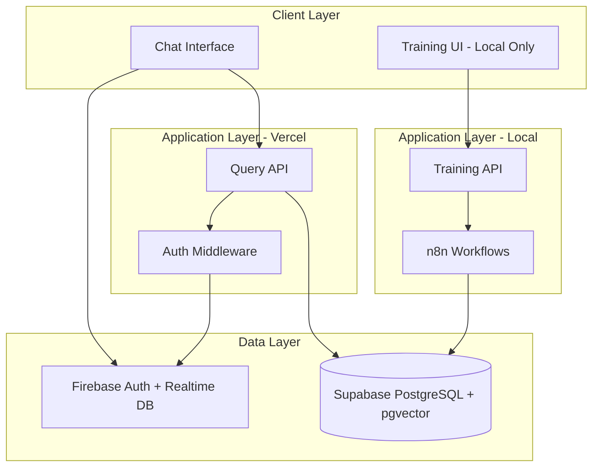
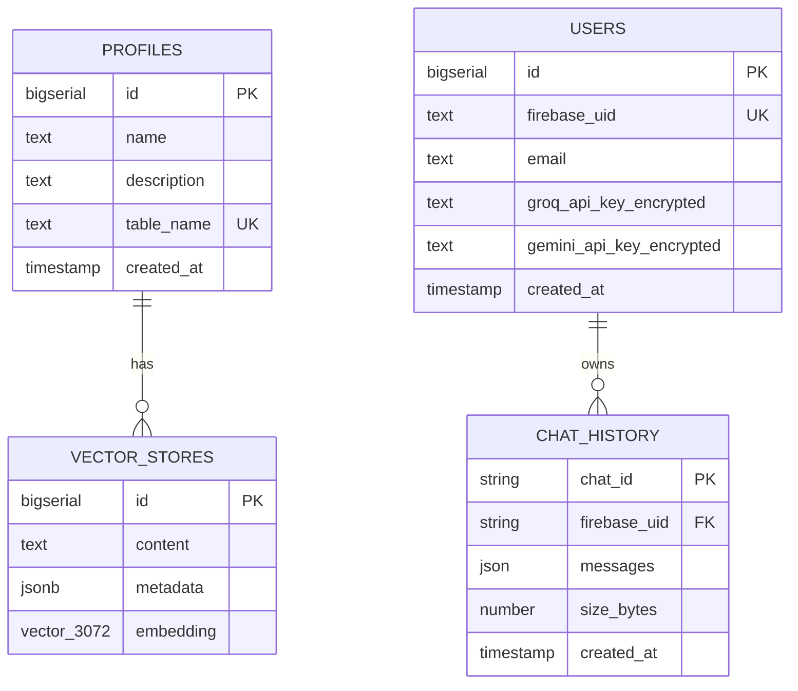

# Design Document: RAG Customs Multi-Profile System

## Overview

RAG Customs transforms the single-profile RAG School system into a multi-tenant architecture supporting independent knowledge bases (profiles) such as School, Civil, UBA, etc. The system maintains a centralized training approach (local with n8n) while enabling distributed querying where users provide their own API keys.

The architecture separates concerns into two distinct runtime environments:
- **Public Environment**: Query-only interface deployed on Vercel for end users
- **Admin Environment**: Local training interface with n8n integration for knowledge base management

Key architectural decisions:
- **Profile Isolation**: Each profile has its own Supabase vector store table with dedicated match function
- **User-Provided API Keys**: Users supply their own Groq and Gemini API keys, eliminating shared API costs
- **Firebase Integration**: Firebase Authentication for user management and Firebase Realtime Database for optional chat history (100MB per user)
- **Minimal Migration**: Existing single-table architecture migrates to a default "School" profile with minimal code changes

## Architecture

### System Components



### Multi-Profile Vector Store Architecture



### Data Flow

**Query Flow (User-Provided API Keys)**:
1. User authenticates via Firebase (optional)
2. User selects profile from dropdown
3. User submits query with chunk count selection
4. System retrieves user's API keys from Supabase
5. System generates embedding using user's Gemini API key
6. System queries selected profile's vector store
7. System generates answer using user's Groq API key
8. System optionally saves conversation to Firebase Realtime DB

**Training Flow (Admin-Only, Local)**:
1. Admin runs local training UI (`npm run train`)
2. Admin uploads file or enters text
3. Admin selects target profile
4. n8n workflow processes content (chunking, embedding)
5. System inserts documents into profile's vector store
6. System returns metrics (chunks inserted, storage used)

## Components and Interfaces

### Frontend Components

#### ChatInterface Component
- **Location**: `components/chat-interface.tsx`
- **Responsibilities**:
  - Render chat UI with profile selector
  - Handle authentication modal
  - Manage chat history sidebar (when authenticated)
  - Submit queries to backend
  - Display storage usage (0-100MB)
- **State**:
  - `selectedProfile`: Current profile ID
  - `chunkCount`: Number of chunks to retrieve (4, 8, 12, 16)
  - `isAuthenticated`: Firebase auth state
  - `messages`: Current conversation
  - `chatHistory`: List of saved chats from Firebase

#### ProfileSelector Component
- **Location**: `components/profile-selector.tsx` (new)
- **Responsibilities**:
  - Load available profiles from `/api/profiles`
  - Display profile dropdown with name and description
  - Persist selection to localStorage
- **Props**:
  - `value`: Current profile ID
  - `onChange`: Callback when profile changes

#### AuthModal Component
- **Location**: `components/auth-modal.tsx` (new)
- **Responsibilities**:
  - Display email input for Firebase authentication
  - Show API key input fields (Groq, Gemini)
  - Handle authentication flow
  - Save encrypted API keys to backend
- **State**:
  - `email`: User email
  - `groqApiKey`: User's Groq API key
  - `geminiApiKey`: User's Gemini API key

#### ChatHistorySidebar Component
- **Location**: `components/chat-history-sidebar.tsx` (new)
- **Responsibilities**:
  - Display list of saved chats from Firebase
  - Show chat size and delete button
  - Display storage usage meter
  - Handle chat selection and deletion
- **Props**:
  - `firebaseUid`: Current user's Firebase UID
  - `onChatSelect`: Callback when chat is selected

### Backend API Routes

#### `/api/query` (POST)
- **Environment**: Public (Vercel)
- **Authentication**: Optional (Firebase token)
- **Request Body**:
  ```typescript
  {
    question: string
    chunkCount: number
    profileId: string
    firebaseUid?: string  // Optional, for API key lookup
  }
  ```
- **Response**:
  ```typescript
  {
    success: boolean
    answer?: string
    matches?: MatchDocument[]
    error?: string
  }
  ```
- **Logic**:
  1. Validate profile exists
  2. Retrieve user's API keys if authenticated
  3. Generate embedding with user's Gemini key (or fallback to system key)
  4. Query profile's vector store
  5. Generate answer with user's Groq key (or fallback to system key)

#### `/api/train` (POST)
- **Environment**: Admin-only (Local)
- **Authentication**: None (local access only)
- **Request Body**: FormData with `file` or `text` and `profileId`
- **Response**:
  ```typescript
  {
    success: boolean
    inserted?: number
    chunks?: number
    error?: string
  }
  ```
- **Logic**:
  1. Validate profile exists
  2. Extract content from file or text
  3. Chunk content
  4. Generate embeddings (system Gemini key)
  5. Insert into profile's vector store

#### `/api/profiles` (GET)
- **Environment**: Public (Vercel)
- **Authentication**: None
- **Response**:
  ```typescript
  {
    success: boolean
    profiles?: Array<{
      id: string
      name: string
      description: string
    }>
  }
  ```

#### `/api/profiles/metrics` (GET)
- **Environment**: Public (Vercel)
- **Authentication**: None
- **Query Params**: `profileId`
- **Response**:
  ```typescript
  {
    success: boolean
    metrics?: {
      estimatedStorageBytes: number
      totalChunks: number
      uniqueSources: number
      sourceTypes: Record<string, number>
    }
  }
  ```

#### `/api/auth/save-keys` (POST)
- **Environment**: Public (Vercel)
- **Authentication**: Required (Firebase token)
- **Request Body**:
  ```typescript
  {
    groqApiKey: string
    geminiApiKey: string
  }
  ```
- **Response**:
  ```typescript
  {
    success: boolean
    error?: string
  }
  ```
- **Logic**:
  1. Validate Firebase token
  2. Encrypt API keys
  3. Upsert to users table

#### `/api/chat/save` (POST)
- **Environment**: Public (Vercel)
- **Authentication**: Required (Firebase token)
- **Request Body**:
  ```typescript
  {
    messages: Array<{role: string, content: string}>
    chatId?: string  // Optional, for updating existing chat
  }
  ```
- **Response**:
  ```typescript
  {
    success: boolean
    chatId?: string
    sizeBytes?: number
    error?: string
  }
  ```
- **Logic**:
  1. Validate Firebase token
  2. Calculate message size
  3. Check user's storage limit (100MB)
  4. Save to Firebase Realtime Database

### Library Modules

#### `lib/server/profiles.ts` (new)
```typescript
export async function getProfile(profileId: string): Promise<Profile | null>
export async function listProfiles(): Promise<Profile[]>
export async function createProfile(profile: CreateProfileInput): Promise<Profile>
export async function getProfileVectorStore(profileId: string): Promise<string>
```

#### `lib/server/auth.ts` (new)
```typescript
export async function verifyFirebaseToken(token: string): Promise<DecodedToken>
export async function getUserApiKeys(firebaseUid: string): Promise<UserApiKeys | null>
export async function saveUserApiKeys(firebaseUid: string, keys: ApiKeysInput): Promise<void>
```

#### `lib/server/encryption.ts` (new)
```typescript
export function encryptApiKey(apiKey: string): string
export function decryptApiKey(encrypted: string): string
```

#### `lib/server/firebase.ts` (new)
```typescript
export async function saveChat(firebaseUid: string, messages: Message[], chatId?: string): Promise<SaveChatResult>
export async function listChats(firebaseUid: string): Promise<ChatMetadata[]>
export async function deleteChat(firebaseUid: string, chatId: string): Promise<void>
export async function getUserStorageUsage(firebaseUid: string): Promise<number>
```

#### `lib/server/supabase.ts` (modified)
- Add `profileId` parameter to `insertDocuments` and `matchDocuments`
- Dynamically resolve table name and match function based on profile

## Data Models

### Supabase Schema

#### profiles table
```sql
create table profiles (
  id bigserial primary key,
  name text not null unique,
  description text,
  table_name text not null unique,
  created_at timestamp with time zone default now()
);
```

#### users table
```sql
create table users (
  id bigserial primary key,
  firebase_uid text not null unique,
  email text not null,
  groq_api_key_encrypted text,
  gemini_api_key_encrypted text,
  created_at timestamp with time zone default now()
);
```

#### Dynamic vector store tables (e.g., documents_school, documents_civil)
```sql
create table documents_[profile] (
  id bigserial primary key,
  content text,
  metadata jsonb,
  embedding vector(3072)
);

create or replace function match_documents_[profile](
  query_embedding vector(3072),
  match_count int default 8,
  filter jsonb default '{}'
)
returns table (id bigint, content text, metadata jsonb, similarity float)
language sql stable
as $$
  select id, content, metadata,
    1 - (embedding <=> query_embedding) as similarity
  from documents_[profile]
  where metadata @> filter
  order by embedding <=> query_embedding
  limit match_count;
$$;
```

### Firebase Realtime Database Schema

```json
{
  "chats": {
    "[firebaseUid]": {
      "[chatId]": {
        "messages": [
          {"role": "user", "content": "..."},
          {"role": "assistant", "content": "..."}
        ],
        "sizeBytes": 1234,
        "createdAt": 1234567890,
        "updatedAt": 1234567890,
        "name": "Chat #1"
      }
    }
  }
}
```

### TypeScript Interfaces

```typescript
interface Profile {
  id: string
  name: string
  description: string
  tableName: string
  createdAt: string
}

interface User {
  id: string
  firebaseUid: string
  email: string
  groqApiKeyEncrypted?: string
  geminiApiKeyEncrypted?: string
  createdAt: string
}

interface UserApiKeys {
  groqApiKey?: string
  geminiApiKey?: string
}

interface ChatMetadata {
  chatId: string
  name: string
  sizeBytes: number
  createdAt: number
  updatedAt: number
}

interface Message {
  role: "user" | "assistant"
  content: string
}

interface SaveChatResult {
  chatId: string
  sizeBytes: number
}
```

### Configuration File

**Location**: `profiles.config.json`
```json
{
  "profiles": [
    {
      "name": "School",
      "description": "Documentos académicos y materiales de estudio",
      "tableName": "documents_school"
    },
    {
      "name": "Civil",
      "description": "Legislación y documentos de derecho civil",
      "tableName": "documents_civil"
    },
    {
      "name": "UBA",
      "description": "Recursos específicos de la Universidad de Buenos Aires",
      "tableName": "documents_uba"
    }
  ]
}
```


## Correctness Properties

*A property is a characteristic or behavior that should hold true across all valid executions of a system-essentially, a formal statement about what the system should do. Properties serve as the bridge between human-readable specifications and machine-verifiable correctness guarantees.*

### Property Reflection

After analyzing all acceptance criteria, several redundancies were identified:
- Requirements 1.4 and 6.2 both test query isolation (combined into Property 1)
- Requirements 4.4 and 6.5 both test chunk options (kept as example, not property)
- Requirements 3.2 and 11.1 both test API key encryption (combined into Property 3)
- Multiple UI rendering tests can be consolidated into examples rather than properties

### Property 1: Query Isolation by Profile

*For any* query with a selected profile ID, all returned documents should originate exclusively from that profile's vector store table, ensuring complete data isolation between profiles.

**Validates: Requirements 1.4, 6.2**

### Property 2: Profile Creation Generates Vector Store

*For any* valid profile creation request with name and description, the system should create a corresponding vector store table in Supabase with the naming pattern `documents_[profile_name_normalized]` and a matching `match_documents_[profile_name_normalized]` function.

**Validates: Requirements 1.2, 8.5**

### Property 3: Profile Metadata Completeness

*For any* profile record in the profiles table, the record should contain all required fields: id, name, description, table_name, and created_at.

**Validates: Requirements 1.3**

### Property 4: Embedding Dimension Consistency

*For any* embedding generated by the system (for any profile, any content), the embedding vector should have exactly 3072 dimensions.

**Validates: Requirements 1.5**

### Property 5: Firebase Authentication Creates User Record

*For any* successful Firebase authentication (new or existing email), the system should ensure a corresponding user record exists in Supabase with firebase_uid, email, and created_at fields populated.

**Validates: Requirements 2.2, 2.3, 2.4**

### Property 6: Session Persistence Across Refreshes

*For any* authenticated user session, refreshing the page should maintain the authentication state without requiring re-login.

**Validates: Requirements 2.7**

### Property 7: Unauthenticated Query Access

*For any* query submitted without authentication, the system should successfully process the query using system default API keys and return results without requiring login.

**Validates: Requirements 2.8**

### Property 8: API Key Encryption at Rest

*For any* API key (Groq or Gemini) stored in the users table, the stored value should be encrypted (not plaintext), verifiable by attempting to use the stored value directly as an API key (which should fail).

**Validates: Requirements 3.2, 11.1**

### Property 9: User-Specific API Key Usage

*For any* authenticated user with stored API keys, queries submitted by that user should use their specific API keys for embedding generation (Gemini) and response generation (Groq), not system default keys.

**Validates: Requirements 3.3, 6.1, 6.3**

### Property 10: API Key Validation Error Handling

*For any* query where the user's API keys are missing, invalid, or expired, the system should return a descriptive error message indicating the specific API key issue rather than a generic failure.

**Validates: Requirements 3.4**

### Property 11: API Key Format Validation

*For any* API key submission (Groq or Gemini), the system should validate the format before storage and reject keys that don't match expected patterns (e.g., minimum length, character set).

**Validates: Requirements 3.5**

### Property 12: API Key Update Capability

*For any* authenticated user with existing API keys, submitting new API keys should successfully update the stored encrypted values and use the new keys for subsequent queries.

**Validates: Requirements 3.6**

### Property 13: Header Profile Name Display

*For any* selected profile, the header should display "RAG [Profile.name]" where Profile.name matches the name field from the profiles table.

**Validates: Requirements 4.2**

### Property 14: Profile Selector Database Sync

*For any* state of the profiles table, the profile selector dropdown options should exactly match the available profiles in the database (by id and name).

**Validates: Requirements 4.3**

### Property 15: Authenticated Header Button Visibility

*For any* authentication state (authenticated or not), the header should display "Cuenta" button when not authenticated, or "Guardar chat" and "Nuevo chat" buttons when authenticated, but never both sets simultaneously.

**Validates: Requirements 4.5**

### Property 16: Message Display Completeness

*For any* conversation with N messages, the main area should render exactly N message components with correct role (user/assistant) and content.

**Validates: Requirements 4.6**

### Property 17: Textarea Auto-Expansion Bounds

*For any* text input in the textarea, the height should auto-expand to fit content up to a maximum of 6 lines (approximately 120px), after which scrolling should be enabled.

**Validates: Requirements 4.7**

### Property 18: Profile Selection Persistence

*For any* profile selection, the selected profile ID should persist in localStorage and be restored when the page is refreshed or reopened.

**Validates: Requirements 4.9**

### Property 19: Training Profile Targeting

*For any* training request with a profile_id parameter, the system should insert generated chunks exclusively into that profile's vector store table.

**Validates: Requirements 5.5**

### Property 20: Multi-Format File Processing

*For any* supported file type (PDF, text, image, audio, video, PPTX, CSV, Excel), the training system should successfully extract content and generate chunks without errors.

**Validates: Requirements 5.6, 5.7**

### Property 21: Training Response Completeness

*For any* successful training operation, the response should include both `inserted` (number of chunks inserted) and `success: true` fields.

**Validates: Requirements 5.8**

### Property 22: Query Response Similarity Scores

*For any* successful query response, each matched document should include a similarity score (float between 0 and 1).

**Validates: Requirements 6.4**

### Property 23: Chat List Format Consistency

*For any* saved chat displayed in the sidebar, the rendered format should include chat identifier, size in KB or MB, and a delete icon.

**Validates: Requirements 7.2**

### Property 24: Chat Size Unit Conversion

*For any* chat with size S bytes, the displayed size should be in KB if S < 1,000,000, otherwise in MB with appropriate decimal precision.

**Validates: Requirements 7.4**

### Property 25: Chat Deletion Removes from Firebase

*For any* chat deletion action, the chat should be removed from Firebase Realtime Database and no longer appear in the user's chat list.

**Validates: Requirements 7.5**

### Property 26: Conversation Firebase Persistence

*For any* saved conversation, the messages should be stored in Firebase Realtime Database under the path `/chats/[firebaseUid]/[chatId]` and be retrievable.

**Validates: Requirements 7.7**

### Property 27: Storage Limit Enforcement

*For any* user with total chat storage >= 100MB, attempting to save a new chat should be rejected with an error message indicating the storage limit has been reached.

**Validates: Requirements 7.8**

### Property 28: Profile Table Name Uniqueness

*For any* two distinct profiles, their table_name values should be unique (no two profiles share the same vector store table).

**Validates: Requirements 8.3**

### Property 29: Vector Store Schema Consistency

*For any* profile's vector store table, the schema should match the standard structure: columns for id (bigserial), content (text), metadata (jsonb), and embedding (vector(3072)).

**Validates: Requirements 8.4**

### Property 30: Profile Metrics Display Completeness

*For any* selected profile, the metrics display should include all four values: estimated storage size (MB), total chunk count, unique source count, and source type breakdown.

**Validates: Requirements 10.1, 10.2, 10.3, 10.4**

### Property 31: Metrics Update After Training

*For any* training operation that inserts N chunks, querying the profile metrics immediately after should reflect the increased chunk count (previous count + N).

**Validates: Requirements 10.5**

### Property 32: Authentication Token Validation

*For any* API request to authenticated endpoints, the system should validate the Firebase authentication token and reject requests with missing or invalid tokens with a 401 status code.

**Validates: Requirements 11.3, 11.5**

### Property 33: User Data Isolation

*For any* authenticated user, queries to retrieve their API keys or chat history should return only data associated with their firebase_uid, never data from other users.

**Validates: Requirements 11.4**

### Property 34: Configuration Profile Validation

*For any* profile definition in the configuration file, the parser should validate that required fields (name, description, table_name) are present and non-empty before loading the profile.

**Validates: Requirements 12.2**


## Error Handling

### Client-Side Error Handling

**Authentication Errors**:
- Firebase authentication failures should display user-friendly messages in the auth modal
- Network errors during authentication should show retry option
- Invalid email format should be caught by HTML5 validation before submission

**Query Errors**:
- API key errors should display specific messages: "Groq API key invalid" or "Gemini API key missing"
- Empty profile errors should display: "El perfil seleccionado no tiene documentos. Por favor, entrena el perfil primero."
- Network timeouts should display: "La consulta tardó demasiado. Por favor, intenta de nuevo."
- Generic errors should display: "Ocurrió un error al procesar tu consulta. Por favor, intenta de nuevo."

**Storage Errors**:
- Storage limit exceeded should display: "Has alcanzado el límite de 100MB. Elimina chats antiguos para continuar."
- Firebase save failures should display: "No se pudo guardar el chat. Verifica tu conexión."

**Profile Selection Errors**:
- Missing profile should display: "El perfil seleccionado no está disponible."
- Profile load failure should display: "No se pudieron cargar los perfiles. Recarga la página."

### Server-Side Error Handling

**Query API (`/api/query`)**:
```typescript
// Error hierarchy
try {
  // Validate profile exists
  if (!profile) {
    return NextResponse.json(
      { success: false, error: "Perfil no encontrado" },
      { status: 404 }
    )
  }
  
  // Validate user API keys if authenticated
  if (firebaseUid && !userApiKeys) {
    return NextResponse.json(
      { success: false, error: "Configura tus API keys en Cuenta" },
      { status: 400 }
    )
  }
  
  // Handle embedding generation errors
  // Handle vector store query errors
  // Handle LLM generation errors
  
} catch (error) {
  // Log error for debugging
  console.error("Query error:", error)
  
  // Return generic error to client
  return NextResponse.json(
    { success: false, error: "Error al procesar la consulta" },
    { status: 500 }
  )
}
```

**Training API (`/api/train`)**:
```typescript
try {
  // Validate profile exists
  if (!profile) {
    return NextResponse.json(
      { success: false, error: "Perfil no encontrado" },
      { status: 404 }
    )
  }
  
  // Validate file or text provided
  if (!file && !text) {
    return NextResponse.json(
      { success: false, error: "Debes proporcionar un archivo o texto" },
      { status: 400 }
    )
  }
  
  // Handle file extraction errors
  // Handle chunking errors
  // Handle embedding errors
  // Handle database insertion errors
  
} catch (error) {
  console.error("Training error:", error)
  return NextResponse.json(
    { success: false, error: "Error al entrenar el perfil" },
    { status: 500 }
  )
}
```

**Authentication Middleware**:
```typescript
// Validate Firebase token
try {
  const token = request.headers.get("Authorization")?.replace("Bearer ", "")
  
  if (!token) {
    return NextResponse.json(
      { success: false, error: "Token de autenticación requerido" },
      { status: 401 }
    )
  }
  
  const decodedToken = await verifyFirebaseToken(token)
  
  if (!decodedToken) {
    return NextResponse.json(
      { success: false, error: "Token inválido o expirado" },
      { status: 401 }
    )
  }
  
  // Attach user info to request
  request.user = decodedToken
  
} catch (error) {
  return NextResponse.json(
    { success: false, error: "Error de autenticación" },
    { status: 401 }
  )
}
```

### Database Error Handling

**Supabase Connection Errors**:
- Retry logic with exponential backoff for transient failures
- Connection pool exhaustion should log error and return 503 Service Unavailable
- Query timeouts should return descriptive error after 30 seconds

**Firebase Realtime Database Errors**:
- Write failures should retry up to 3 times
- Permission denied errors should return 403 with message
- Quota exceeded errors should return 429 with retry-after header

### Validation Error Handling

**Input Validation**:
- Empty queries should be rejected client-side before submission
- Profile ID validation should check against loaded profiles
- Chunk count validation should enforce allowed values (4, 8, 12, 16)
- API key format validation should check minimum length and character set

**Data Validation**:
- Embedding dimension validation should verify 3072 dimensions
- Profile configuration validation should check required fields
- User record validation should verify firebase_uid uniqueness

## Testing Strategy

### Dual Testing Approach

The testing strategy employs both unit tests and property-based tests to ensure comprehensive coverage:

- **Unit Tests**: Verify specific examples, edge cases, error conditions, and integration points
- **Property Tests**: Verify universal properties across all inputs through randomization

Both approaches are complementary and necessary. Unit tests catch concrete bugs in specific scenarios, while property tests verify general correctness across a wide input space.

### Property-Based Testing Configuration

**Library Selection**:
- **JavaScript/TypeScript**: Use `fast-check` library for property-based testing
- **Installation**: `npm install --save-dev fast-check @types/fast-check`

**Test Configuration**:
- Minimum 100 iterations per property test (due to randomization)
- Each property test must reference its design document property
- Tag format: `// Feature: rag-customs-multi-profile, Property {number}: {property_text}`

**Example Property Test Structure**:
```typescript
import fc from 'fast-check'

describe('RAG Customs Multi-Profile', () => {
  // Feature: rag-customs-multi-profile, Property 1: Query Isolation by Profile
  it('should return documents only from selected profile', () => {
    fc.assert(
      fc.asyncProperty(
        fc.string(), // profileId
        fc.string(), // query
        async (profileId, query) => {
          // Setup: Create profile and insert test documents
          // Execute: Query with profileId
          // Verify: All returned documents are from profileId's table
        }
      ),
      { numRuns: 100 }
    )
  })
})
```

### Unit Testing Strategy

**Component Tests** (React Testing Library):
- ChatInterface: Authentication modal, profile selector, message rendering
- ProfileSelector: Dropdown population, selection persistence
- AuthModal: Form validation, API key input, submission
- ChatHistorySidebar: Chat list rendering, deletion, storage display

**API Route Tests** (Jest + Supertest):
- `/api/query`: Valid queries, missing API keys, invalid profiles, empty profiles
- `/api/train`: File upload, text input, profile targeting, error cases
- `/api/profiles`: Profile listing, metrics retrieval
- `/api/auth/save-keys`: Key encryption, validation, updates
- `/api/chat/save`: Storage limit enforcement, Firebase persistence

**Integration Tests**:
- End-to-end query flow: Authentication → Profile selection → Query → Response
- Training flow: File upload → Chunking → Embedding → Storage
- Chat history flow: Save → List → Load → Delete

**Edge Cases and Error Conditions**:
- Empty profile queries (Requirement 6.6)
- Storage limit exceeded (Requirement 7.11)
- Invalid authentication tokens (Requirement 11.5)
- Missing profile vector store table (Requirement 12.4)
- API key format validation (Requirement 3.5)

### Property-Based Test Coverage

Each correctness property should be implemented as a property-based test:

**Profile Isolation Properties** (Properties 1, 2, 19):
```typescript
// Generate random profiles, documents, and queries
// Verify isolation between profiles
fc.record({
  profiles: fc.array(fc.record({ name: fc.string(), description: fc.string() })),
  documents: fc.array(fc.record({ content: fc.string(), profileId: fc.string() })),
  query: fc.string()
})
```

**Authentication Properties** (Properties 5, 6, 7):
```typescript
// Generate random emails and authentication states
// Verify user record creation and session persistence
fc.record({
  email: fc.emailAddress(),
  isNewUser: fc.boolean()
})
```

**API Key Properties** (Properties 8, 9, 11, 12):
```typescript
// Generate random API keys and encryption scenarios
// Verify encryption, usage, validation, and updates
fc.record({
  groqKey: fc.string({ minLength: 20 }),
  geminiKey: fc.string({ minLength: 20 })
})
```

**UI State Properties** (Properties 13, 14, 15, 16, 17, 18):
```typescript
// Generate random UI states and user interactions
// Verify rendering consistency and state persistence
fc.record({
  isAuthenticated: fc.boolean(),
  selectedProfile: fc.string(),
  messages: fc.array(fc.record({ role: fc.constantFrom('user', 'assistant'), content: fc.string() }))
})
```

**Storage Properties** (Properties 23, 24, 25, 26, 27):
```typescript
// Generate random chat data and storage scenarios
// Verify format, persistence, deletion, and limits
fc.record({
  chats: fc.array(fc.record({ messages: fc.array(fc.string()), sizeBytes: fc.nat() })),
  totalStorage: fc.nat({ max: 120_000_000 }) // Test around 100MB limit
})
```

**Data Integrity Properties** (Properties 3, 4, 22, 28, 29, 30, 31):
```typescript
// Generate random data structures
// Verify schema consistency, uniqueness, and completeness
fc.record({
  embedding: fc.array(fc.float(), { minLength: 3072, maxLength: 3072 }),
  profile: fc.record({ name: fc.string(), tableName: fc.string() })
})
```

### Test Organization

```
tests/
├── unit/
│   ├── components/
│   │   ├── chat-interface.test.tsx
│   │   ├── profile-selector.test.tsx
│   │   ├── auth-modal.test.tsx
│   │   └── chat-history-sidebar.test.tsx
│   ├── api/
│   │   ├── query.test.ts
│   │   ├── train.test.ts
│   │   ├── profiles.test.ts
│   │   └── auth.test.ts
│   └── lib/
│       ├── profiles.test.ts
│       ├── auth.test.ts
│       ├── encryption.test.ts
│       └── firebase.test.ts
├── property/
│   ├── profile-isolation.property.test.ts
│   ├── authentication.property.test.ts
│   ├── api-keys.property.test.ts
│   ├── ui-state.property.test.ts
│   ├── storage.property.test.ts
│   └── data-integrity.property.test.ts
└── integration/
    ├── query-flow.test.ts
    ├── training-flow.test.ts
    └── chat-history-flow.test.ts
```

### Testing Priorities

**High Priority** (Core Functionality):
1. Query isolation by profile (Property 1)
2. API key encryption and usage (Properties 8, 9)
3. Authentication and user record creation (Property 5)
4. Storage limit enforcement (Property 27)
5. Profile targeting in training (Property 19)

**Medium Priority** (User Experience):
1. UI state consistency (Properties 13-18)
2. Chat history persistence (Properties 23-26)
3. Profile metrics accuracy (Properties 30-31)
4. Error handling (Properties 10, 22, 32)

**Low Priority** (Edge Cases):
1. Configuration validation (Property 34)
2. Schema consistency (Property 29)
3. Table name uniqueness (Property 28)

### Continuous Integration

**Pre-commit Hooks**:
- Run unit tests for changed files
- Run linting and type checking

**CI Pipeline** (GitHub Actions):
1. Run all unit tests
2. Run all property-based tests (100 iterations each)
3. Run integration tests
4. Generate coverage report (target: >80%)
5. Build production bundle
6. Deploy to Vercel preview environment

**Performance Testing**:
- Measure query response time (target: <2s for 8 chunks)
- Measure training throughput (target: >100 chunks/minute)
- Measure page load time (target: <0.7s first load, <0.2s subsequent)
